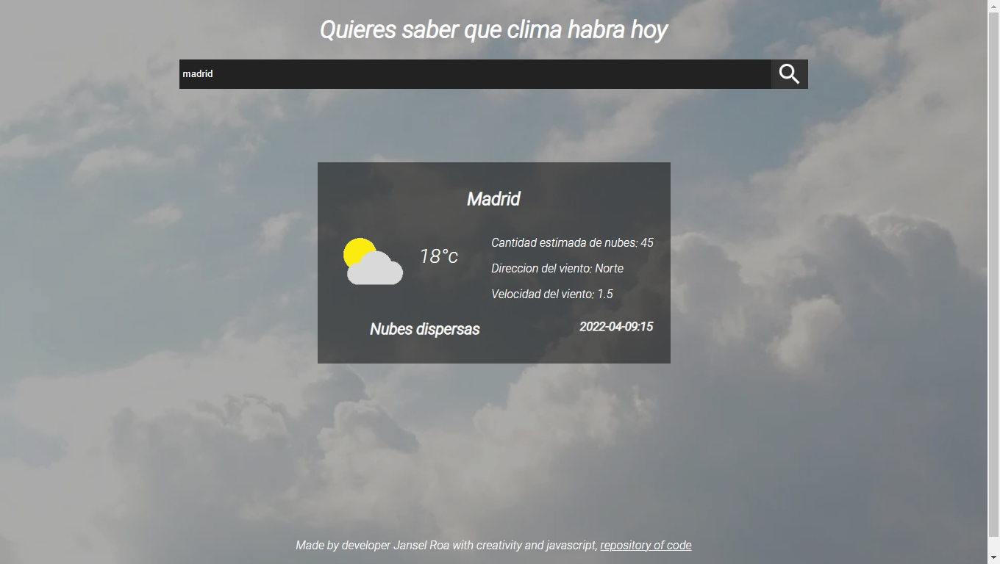

# weather app
## Preview



## Download
```
git clone https://github.com/janselroa/weather-app.git
```
then open the index.html file and you can use the app
watch live on https://wondrous-cheesecake-e6a2f6.netlify.app/

made with weatherbit api https://www.weatherbit.io/
